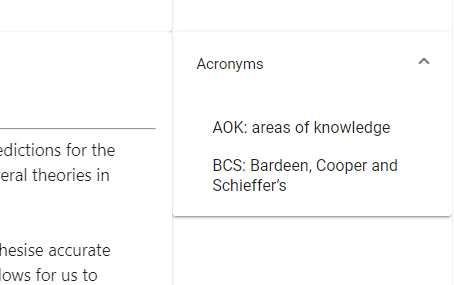

# Simplexia - AstraZeneca Neurodiversity Hackathon 2021

Individuals with dyslexia can find it challenging to focus when reading large documents.

Simplexia's purpose is to address this issue by condensing lengthy texts into shortened summaries that make for easier reading.

By harnessing DeepAI's [text summary](https://deepai.org/machine-learning-model/summarization) and [text tagging](https://deepai.org/machine-learning-model/text-tagging) APIs, Simplexia simplifies the process of absorbing long documents by producing summaries, expanding acronyms and presenting lists of keywords.

 

**Condensed text** is presented as a list of the input's key sentences.

 

**Highlighted text** is presented with the key sentences highlighted.

 

**Keywords** can be accessed from a drop down list on the left hand side.

 

**Acronyms** and their definitions can be accessed to the right hand side via a drop down list, allowing for key information to be recalled easily.

 

In order to enhance readability for dyslexic users, the colour of the background of text fields can be changed via a colour wheel.

 

Here, this colour has been set to a light green tone.

## Setup

Make sure to run `npm install` from both `frontend/` and `backend/` to install all required packages.

### Backend

Run `node server.mjs` from `backend/` to start the backend server.

### Frontend

Run `ng serve` from `frontend/` to start a frontend server.

## Credits
Written by Leo, Elanor and Kathlyn.